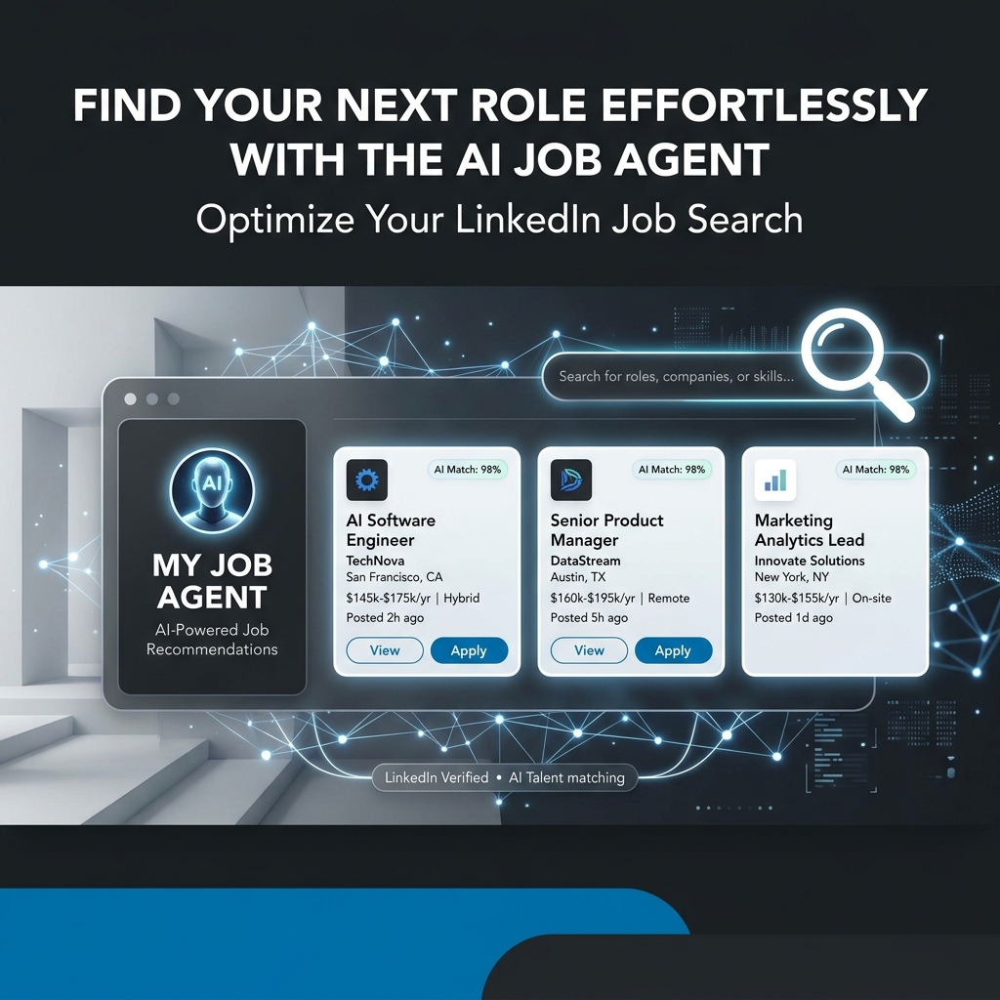
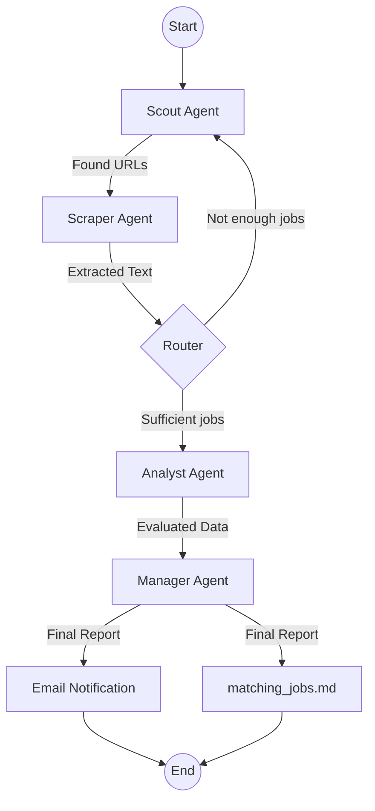

# 💼 LinkedIn Multi-Agent Job Scout



<div align="center">

[](https://www.python.org/)
[](https://github.com/langchain-ai/langgraph)
[](https://playwright.dev/)
[](https://deepmind.google/technologies/gemini/)

</div>

An automated, intelligent, multi-agent system designed to scout, scrape, analyze, and report the best job opportunities from LinkedIn. Built with **LangGraph** and **Google Gemini**, this agent acts as your personal recruitment assistant, filtering only the most relevant leads based on your specific criteria.

---

## 🚀 Key Features

- **Multi-Agent Orchestration**: Powered by a state-of-the-art agentic workflow (Scout, Scraper, Analyst, Manager).
- **Automated LinkedIn Discovery**: Uses Playwright to navigate and discover new job postings daily.
- **Smart Filtering**: Evaluates jobs based on location, salary, and custom keywords (e.g., "Pega", "LSA").
- **Persistence & Deduplication**: Maintains a local state to avoid redundant notifications and manages a blacklist.
- **Email Alerts**: Delivers a polished Markdown report directly to your inbox.
- **Scheduled Execution**: Integrated with GitHub Actions to run effortlessly on weekdays.

---

## 🧠 System Architecture



---

## 🔧 Setup & Installation

### 1. Prerequisites
- Python 3.11+
- [Google Gemini API Key](https://aistudio.google.com/)
- SMTP Settings (for email notifications)

### 2. Clone & Install
```bash
git clone https://github.com/yourusername/Linkedin_job_agent.git
cd Linkedin_job_agent
pip install -r requirements.txt
python -m playwright install chromium --with-deps
```

### 3. Environment Configuration
Create a `.env` file in the root directory:
```env
GOOGLE_API_KEY=your_gemini_api_key
SMTP_SERVER=smtp.gmail.com
SMTP_PORT=465
SMTP_USER=your_email@gmail.com
SMTP_PASSWORD=your_app_password
```

### 4. Search Configuration
Customize your search in `search_queries.txt`:
```text
location: Dallas TX
email: your_email@gmail.com
distance: 25
search_term: pega
max_jobs: 14
keywords: pega, pega lead, pega lsa
```

---

## 📅 Automated Runs

The project is configured to run automatically via **GitHub Actions**. By default, it runs every **weekday at 9 AM CST (14:00 UTC)**.

Results are automatically committed back to the repository and emailed to you.

---

## 📂 Project Structure

- `main.py`: Core logic for the multi-agent system.
- `search_queries.txt`: Configurable search parameters.
- `matching_jobs.md`: The latest curated job list.
- `job_urls.json`: Local database of discovered jobs.
- `blacklist.json`: List of ignored or expired job posts.

---

## 🛡️ License
MIT License. Feel free to use and adapt!
